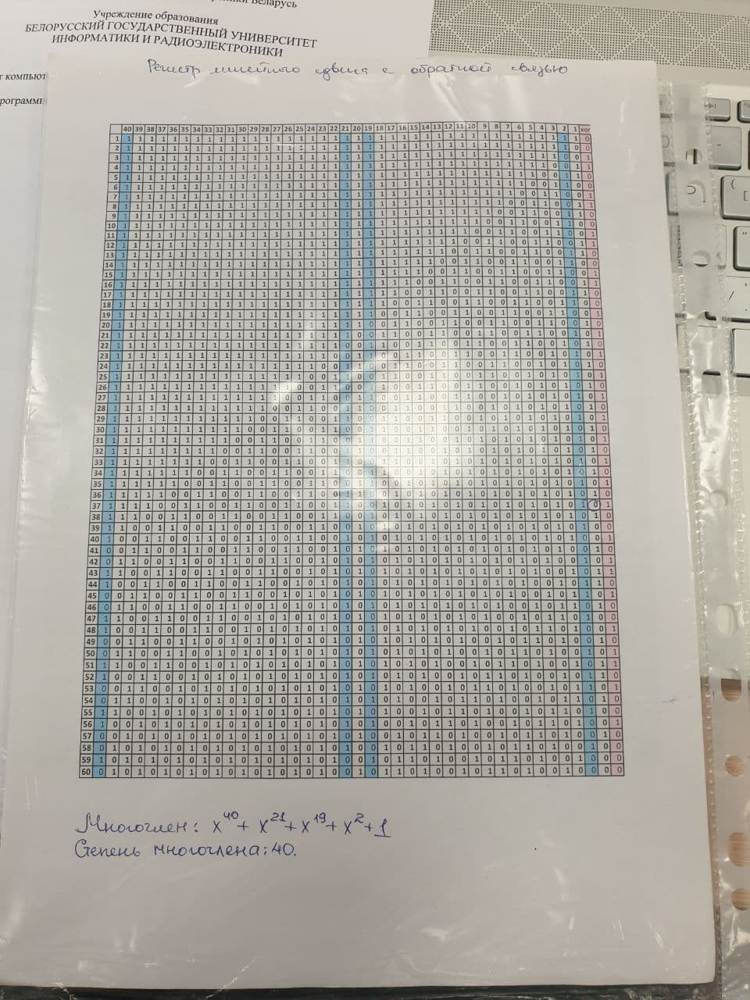

# LFSR Stream cipher(BSUIR Information Theory lab2)
This lab is about stream ciphers. Exactly this implementation based on LFSR key.
## Installing
For the implementation of all laboratory work, I use an end-to-end project with an abstract structure (front-end (in other words, UI) and back-end). To use the project "as is", follow these steps:
1. Clone this project
2. Compile it
3. You are ready to use it!

If you need to make changes to the project logic, you need to find a back-end subproject, and there, if you want to add a new cipher, just add a class that implements the API interface (ICipher). If you need to make changes to the UI, then you need to go to the Front-End subproject.
## Theoretical Background
### From [wiki](https://en.wikipedia.org/wiki/Stream_cipher):
A stream cipher is a symmetric key cipher where plaintext digits are combined with a pseudorandom cipher digit stream (keystream). In a stream cipher, each plaintext digit is encrypted one at a time with the corresponding digit of the keystream, to give a digit of the ciphertext stream. Since encryption of each digit is dependent on the current state of the cipher, it is also known as state cipher. In practice, a digit is typically a bit and the combining operation is an exclusive-or (XOR).

The pseudorandom keystream is typically generated serially from a random seed value using digital shift registers. The seed value serves as the cryptographic key for decrypting the ciphertext stream. Stream ciphers represent a different approach to symmetric encryption from block ciphers. Block ciphers operate on large blocks of digits with a fixed, unvarying transformation. This distinction is not always clear-cut: in some modes of operation, a block cipher primitive is used in such a way that it acts effectively as a stream cipher. Stream ciphers typically execute at a higher speed than block ciphers and have lower hardware complexity. However, stream ciphers can be susceptible to security breaches (see stream cipher attacks); for example, when the same starting state (seed) is used twice.

## Task Formulation:
>Implement a streaming encryption and decryption system for a file with any content using a key sequence generator based on a linear feedback shift register LFSR1 (register dimensions are shown). Enter the initial state of the register from the keyboard. The field for entering the state of the register should ignore any characters other than 0 and 1. Display the generated key (a sequence of 0 and 1), the source file and the encrypted file in binary form. The program must not be written in console mode. The result of the program's operation is an encrypted/decrypted file.

### My task:
Impliment this polinom for LFSR1: **x^32 + x^28 + x^27 + x + 1**

## Program requirements:
- [x] Text entry of the initial state of the key, checking for length and **ignoring all characters except 0 and 1**.
- [x] Displaying the bits of the source file, the bits of the key and the bits of the result one under the other.
- [ ] Add the ability to enter from the UI. Ignore everything except 1 and 0.
- [x] The program must be able to read files with any extension.
- [x] The program must be able to save the file with the result.
- [x] **The program guarantees the equivalence of file conversion through the full cycle of encryption/decryption**.
- [x] Operation between bit-key and bit-file - **xor**.
- [x] Generate exactly as many bytes of the key as required by the size of the input stream.
- [x] The program must run quickly.
- [ ] In case of problems with speed, take only the first n-blocks
- [x] Generation method - LFSR.
### Functional testing:
- [ ] The source file is encrypted with the given key state and then decrypted with the same state. The transformations must be equivalent.
- [ ] [Output values](Task/InitialFunctionalTests/Tests.docx) for the initial state of the key - all 1tsy.
- [x] Make sure that these transformations work with all popular extensions:
**Docx**, **Gif**, **Mp4**, **Jpeg**, **txt**, **BD**, **exe**, **pdf**, ….
- [ ] Make a table of test results.
- [ ] Manually create a key generator table for the "all 1s" state(see an example-1), print it out, compare with point 2.
- [ ] Check the functionality of the entire UI. Error handling style - console on ui.
- [ ] To automate the process, set up an external script that will hash from files and compare to check equivalence. Also check visually.
- [ ] Check UI input key ref text and so on.
### Stress Testing:
- [ ] Check for which size the processing time will take longer:
1s,5s,50s,1min,5min. Make a table with the results. Having found this out, put a limit on the file size and block size with a time of 50s (paragraph 10 of the requirements for the program). Try to optimize the program, the benchmark can be a test bench with encryption built into the platform or similar programs in another language.
- [ ] File generation should be both automatic and manual. Check input from ui.
- [ ] To automate the process, set up an external script that will have a hash of files and compare to check for equivalence. Also check visually.

### Unit tests:
- [ ] Cover 90% of the functional blocks of the back and at least 80% of the entire back-end.

### Task features:
1. Numbering from right to left, the most significant bit goes away, left shift is a feature of LFSR.
2. Topic: Stream encryption systems.
3. Study the [theoretical material](Task/Theory/Theory.docx) for completing task 2.
4. Complete the task according to the given option (my option is 10 and max power is 32).
5. For successful protection, you must have:
   - a correctly working program, which takes into account all the requirements according to the task;
   - tests and files for testing the program;
   - knowledge of theoretical material on the topic of work.

## Printed Documents:
- [ ] A document with a clocked state of the LFSR key generator.

## Git model:
   ### future-forward/dev:

| Step | Name of feature-branch         | Merge in main |
|------|--------------------------------|---------------|
| 1    | step1-add_additional_materials | fast-forward  |
| 2    | step2-add-project-files        | fast-forward  |
| 3    | step3-working-on-ui            | fast-forward  |

## Answers to some questions from theory

1. What bits of the register will be involved in the formation of the value inserted into the first bit? 
>non-zero coefficients of the polynomial determine the bits of the register that will participate in the formation of the value pushed into the first bit.
2. What is the maximum possible period? 
>2^m - 1, where m is the number of digits of the register, the degree of the polynomial.
3. What is the number of digits in the register? 
>degree of polynomial.
4. What is an M-sequence? 
>The sequence of the maximum possible period for a given generator is called an M-sequence.
5. The output of the Geffe generator xG is described as follows:
>xG = (x1 and x2) or (not x1 and x3). The period of this generator is (2^m1 – 1)(2^m2 – 10)(2^m3 – 1), where m1, m2, and m3 are the lengths of the first, second, and third LFSRs, respectively.

## Assets

Example-1:

